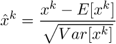
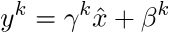
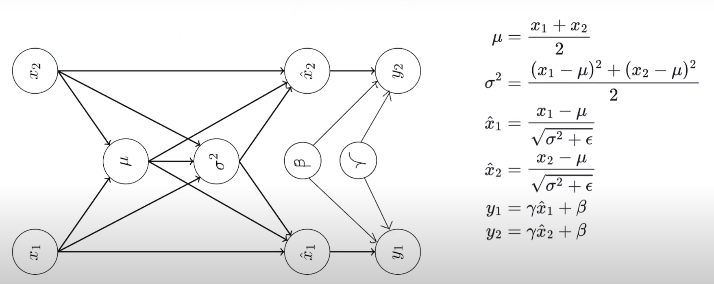

**Table of Contents**
- [Why do we even care ?](#issues-with-training-deep-neural-networks)
- [The equatiosn](#normalization)
- [Advantages](#advantages-of-batch-normalization)
- [Future scope](#future-work)

The [Batch Normalization paper](http://arxiv.org/pdf/1502.03167.pdf) describes a method to address the issues of activations shifting during training of Deep Neural Networks. It makes normalization a part of the architecture itself we observe a much easier convergence thanks to the activations being centered.

It is not an optimization algorithm at all, instead it is a method of adaptive reparametrization.

## Issues With Training Deep Neural Networks

### Assumptions while training

Very deep models involve the composition of several functions, or layers. The gradient tells how to update each parameter, under the assumption that other layers do not change. In practice, we update all the layers simultaneously. When wemake the update, unexpected results can happen because many functions composed together are changed simultaneously, using updates that were computed underthe assumption that the other functions remain constant.

Batch normalization provides an elegant way of reparametrizing almost any deep network. The reparametrization significantly reduces the problem of coordinating updates across many layers.

### Internal Covariate shift

Covariate shift refers to the change in the input distribution to a learning system. In the case of deep networks, the input to each layer is affected by parameters in all the input layers. So even small changes to the network get amplified down the network. This leads to change in the input distribution to internal layers of the deep network and is known as internal covariate shift. 

It is well established that networks converge faster if the inputs have been whitened (ie zero mean, unit variances) and are uncorrelated and internal covariate shift leads to just the opposite.

### Vanishing Gradient 

Saturating nonlinearities (like tanh or sigmoid) can not be used for deep networks as they tend to get stuck in the saturation region as the network grows deeper. Some ways around this are to use:
 * Nonlinearities like ReLU which do not saturate
 * Smaller learning rates
 * Careful initializations 

## Normalization

Let us say that the layer we want to normalize has *d* dimensions **x** *= (x1, ... xd)*. Then, we can normalize the kth dimension as follows:

We also need to scale and shift the normalized values otherwise just normalizing a layer would limit the layer in terms of what it can represent. For example, if we normalize the inputs to a sigmoid function, then the output would be bound to the linear region only.

So the normalized input *xk* is transformed to:

where *γ* and *β* are parameters to be learned.

Moreover, just like we use mini-batch in Stochastic Gradient Descent (SGD), we can use mini-batch with normalization to estimate the mean and variance for each activation.

The transformation from *x* to *y* as described above is called **Batch Normalizing Tranform**. This BN transform is differentiable and ensures that as the model is training, the layers can learn on the input distributions that exhibit less internal covariate shift and can hence accelerate the training.

At training time, a subset of activations in specified and BN transform is applied to all of them.

During test time, normalization is done using the population statistics instead of mini-batch statistics to ensure that the output deterministically depends on the input. 

## Advantages Of Batch Normalization

1. Reduces internal covariant shift.
2. Reduces the dependence of gradients on the scale of the parameters or their initial values.
3. Regularizes the model and reduces the need for dropout and other regularization techniques.
4. Allows use of saturating non-linearities and higher learning rates.

## Future Work

While BN Transform does enhance the overall deep network training task, its precise effect on gradient propagation is still not well understood. 
The computational graph for batch-norm is as follows :

 

A future extension of Batch Normalisation would be in the domain of Recurrent Neural Networks where internal covariate shift and vanishing gradients are more severe.